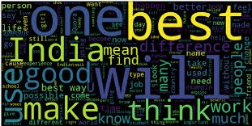
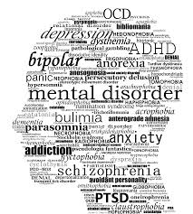
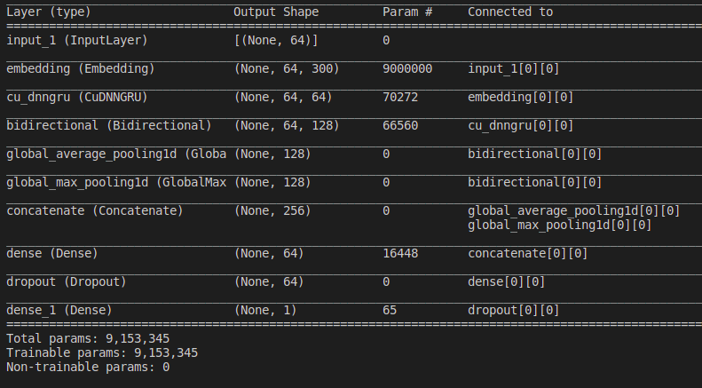

# Insincere-Question-Classifier-Using-Google-Word-Vectors
<!-- PROJECT LOGO -->
<br />
<p align="center">
    
  </a>

  <h2 align="center">Insincere Question Classifier Using Google Word Vectors</h2>

  <p align="center">
    An awesome neural model for filtering lame and bloated queries on the web.
    <br />
    
  </p>
</p>

<!-- TABLE OF CONTENTS -->
<details open="open">
  <summary>Table of Contents</summary>
  <ol>
    <li>
      <a href="#about-the-project">About The Project</a>
      <ul>
        <li><a href="#built-with">Built With</a></li>
      </ul>
    </li>
    <li>
      <a href="#getting-started">Getting Started</a>
      <ul>
        <li><a href="#prerequisites">Prerequisites</a></li>
        <li><a href="#installation">Installation</a></li>
      </ul>
    </li>
    <li><a href="#usage">Usage</a></li>
    <li><a href="#roadmap">Roadmap</a></li>
    <li><a href="#contributing">Contributing</a></li>
    <li><a href="#acknowledgements">Acknowledgements</a></li>
    <li><a href="#future_updates">Future Updates</a></li>
  </ol>
</details>


<!-- ABOUT THE PROJECT -->
## About The Project

<p align="center">
     

An existential problem for any major website today is how to handle toxic and divisive content.This tool aims at tackling this problem and making social platforms a place where users can feel safe sharing their knowledge with the world.

Impact of Social Media On Mental Health:
* Inadequacy about your life or appearance
* Fear of missing out (FOMO)
* Isolation
* Depression and anxiety
* Cyberbullying
* Self-absorption

This project aims at reducing bloated and insincere questions on the web and enforcing positive reinforcement for its readers.

### Built With

Major Frameworks used are-
* [TensorFlow](https://www.tensorflow.org/)
* [Gensim](https://pypi.org/project/gensim/)
* [Scikit_Learn](https://scikit-learn.org/)
* [Google's_word2vec](https://code.google.com/archive/p/word2vec/)


<!-- GETTING STARTED -->
## Getting Started

The project is currently in deployment stage.The plan is to deploy using cloud resources leveraging the google word embeddings and reducing the response time.

## Prerequisites
I would recommend the user to have a basic understanding of the following before moving on with the project. 
* Vanilla GRU's and LSTM's
* Concept of Word2Vec representations.
* Text cleaning and pre-processing for Deep Learning
<!-- Model Architecture -->

## Model Architecture
Layerwise Stacking of the neural model-
* The model uses GoogleNewsVectors-300 to leverage the pre-trained word embeddings.
* The model consists of a stacked GRU and a BiDirectional LSTM
* The extracted featureset from the above two layers are both avg_pooled and max_pooled for feature map reduction and concatenated.
* The concatenated output is passed to a fully connected layer and finally to a fully connected layer.
<p align="center">
     

* Optimizer-Adam
* Loss-Binary CrossEntropy
* Performance_metric-ROC_AUC
## Training Procedure

1.Clone the repository on your machine.\
\
2.Create a new working python env.\
\
3.Open the CLI in the working directory.\
\
4. Install the required packages using
   ```sh
   pip install -r requirements.txt
   ```
The model has been developed on a CUDA enabled machine.\
5. Download the GoogleNews-vectors-negative300.bin in the working directory.
  ```sh
  brew install wget
   ```
```sh
wget -c "https://s3.amazonaws.com/dl4j-distribution/GoogleNews-vectors-negative300.bin.gz"
```  
6.The working directory should look like this.
```bash
├── create_folds.py
├── Data
│   ├── cleaned_text.csv
│   ├── clean_ex_folds.csv
│   ├── extended_text.csv
│   └── train.csv
├── engine.py
├── extend_coverage.py
├── GoogleNews-vectors-negative300.bin
├── images
│   ├── mental_health.jpeg
│   ├── Model_summary.png
│   └── word_cloud.jpeg
├── model.py
├── __pycache__
│   └── model.cpython-38.pyc
├── README.md
├── requirements.txt
└── text_cleaning.py
```
\
7. Run the script engine.py
```sh
python engine.py
   ``` 

<!-- USAGE EXAMPLES -->
## Usage

The deployment is underway.Only model can be trained and tuned by the user as of now.Stay Tuned for further updates. 


<!-- ROADMAP -->
## Roadmap

See the [open issues](https://github.com/Consultingcriminal/Insincere-Question-Classifier-Using-Google-Word-Vectors/issues) for a list of proposed features (and known issues).


<!-- CONTRIBUTING -->
## Contributing

Contributions are what make the open source community such an amazing place to be learn, inspire, and create. Any contributions you make are **greatly appreciated**.

1. Fork the Project
2. Create your Feature Branch (`git checkout -b feature/AmazingFeature`)
3. Commit your Changes (`git commit -m 'Add some AmazingFeature'`)
4. Push to the Branch (`git push origin feature/AmazingFeature`)
5. Open a Pull Request

<!-- ACKNOWLEDGEMENTS -->
## Acknowledgements
* [Kaggle](https://www.kaggle.com/c/quora-insincere-questions-classification/overview)


<!-- Future Updates-->
## Future Updates
Will be learning cloud deployment and deploying the model in the coming months.\
**Stay Tuned And Happy Learning.**
<!-- MARKDOWN LINKS & IMAGES -->
<!-- https://www.markdownguide.org/basic-syntax/#reference-style-links -->
[contributors-shield]: https://img.shields.io/github/contributors/othneildrew/Best-README-Template.svg?style=for-the-badge
[contributors-url]: https://github.com/othneildrew/Best-README-Template/graphs/contributors
[forks-shield]: https://img.shields.io/github/forks/othneildrew/Best-README-Template.svg?style=for-the-badge
[forks-url]: https://github.com/othneildrew/Best-README-Template/network/members
[stars-shield]: https://img.shields.io/github/stars/othneildrew/Best-README-Template.svg?style=for-the-badge
[stars-url]: https://github.com/othneildrew/Best-README-Template/stargazers
[issues-shield]: https://img.shields.io/github/issues/othneildrew/Best-README-Template.svg?style=for-the-badge
[issues-url]: https://github.com/othneildrew/Best-README-Template/issues
[license-shield]: https://img.shields.io/github/license/othneildrew/Best-README-Template.svg?style=for-the-badge
[license-url]: https://github.com/othneildrew/Best-README-Template/blob/master/LICENSE.txt
[linkedin-shield]: https://img.shields.io/badge/-LinkedIn-black.svg?style=for-the-badge&logo=linkedin&colorB=555
[linkedin-url]: https://linkedin.com/in/othneildrew
[product-screenshot]: images/screenshot.png
